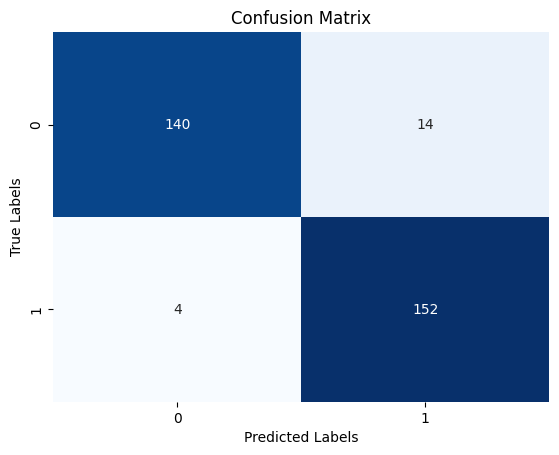

# Arabic Fake Job Advertisements Detection

## 📌 Project Overview
This project aims to detect fake job advertisements written in Arabic using machine learning techniques. The dataset was collected from public job-related posts on the X platform (formerly Twitter), which is one of the most common platforms where job advertisements—both real and fake—are shared.

## 🎯 Objective
To classify Arabic job advertisements into:
- Real Job Advertisements (0)
- Fake Job Advertisements (1)

## 🧠 Problem Statement
Fake job advertisements pose a serious risk to job seekers, especially on social media platforms. These advertisements can lead to financial fraud, data theft, or exploitation. This project addresses this issue by building a machine learning-based classification system capable of identifying fraudulent job postings.

## 🛠 Tools & Technologies
- Python
- Pandas
- NumPy
- Scikit-learn
- Natural Language Processing (NLP)
- Google Colab
- Matplotlib & Seaborn

## 📂 Dataset
- Language: Arabic  
- Source: Public job-related posts from X (Twitter)  
- Data Collection: Manually collected and labeled  
- Note: The dataset is not publicly shared due to privacy and platform usage policies.
However, the notebook clearly demonstrates the full workflow, from preprocessing to evaluation.

## 🔄 Project Workflow
1. Data collection from X platform  
2. Text cleaning and preprocessing (Arabic text normalization)  
3. Feature extraction  
4. Model training using multiple machine learning algorithms  
5. Model evaluation and comparison


## 🤖 Machine Learning Models Used
- Random Forest  
- Support Vector Machine (SVM)  
- K-Nearest Neighbors (KNN)  
- Extreme Gradient Boosting (XGBoost)  
- Decision Tree  

## 📊 Model Performance Comparison

| Model | Accuracy | Precision | Recall | F1-score |
|------|----------|-----------|--------|----------|
| Random Forest | 94.52% | 91.62% | 98.08% | 94.74% |
| Support Vector Machine | 92.26% | 88.37% | 97.44% | 92.68% |
| K-Nearest Neighbors | 81.61% | 80.00% | 84.62% | 82.24% |
| Extreme Gradient Boosting | 92.58% | 92.90% | 92.31% | 92.60% |
| Decision Tree | 92.58% | 94.63% | 90.38% | 92.46% |

## 🧠 Model Selection
Random Forest achieved the best overall performance with the highest F1-score and recall. High recall was prioritized in this project to minimize the risk of misclassifying fake job advertisements as real ones, which is critical in job fraud detection systems.

## 📈 Model Evaluation Results

### Random Forest Confusion Matrix



## 📈 Evaluation Metrics
The models were evaluated using the following metrics:
- Accuracy  
- Precision  
- Recall  
- F1-score  
- Confusion Matrix  

Confusion matrices were used to analyze misclassification cases and better understand model behavior when distinguishing between real and fake job advertisements.


## 🔍 Key Insights
- Ensemble models outperformed distance-based models on Arabic text data.  
- High recall is essential for fake job detection tasks to reduce potential harm to job seekers.  
- Job advertisements on social media platforms present unique challenges due to informal language and varied writing styles.

## 📁 Project Structure

Arabic-Fake-Job-Detection/
│
├── data/ # Dataset directory (not included for privacy reasons)
├── images/ # Evaluation results and visualizations
├── fake_job_ads_detection.ipynb
├── requirements.txt
├── README.md

## 🚀 How to Run the Project

1. Clone the repository:
```bash
git clone https://github.com/Ba1ei/Arabic-Fake-Job-Detection.git
```

2. Install the required libraries:
```bash
pip install -r requirements.txt
```

3. Open and run the notebook:
```bash
jupyter notebook arabic_fake_job_detection.ipynb
```

👩‍💻 Author

Developed by [Bayan Almalawi]
Graduation Project – Machine Learning & NLP
